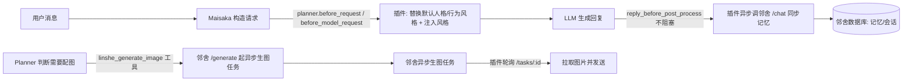

# 邻舍桥接插件 · 架构与说明

> 本文面向维护者/开发者，说明插件的职责、代码分布、数据存储与调试方式；安装与使用请见 [README.md](./README.md)。

## 1. 插件职责

| 能力 | 触发点 | 说明 |
| --- | --- | --- |
| 人格注入 | `before_model_request` / `planner.before_request` | replyer 把 system 人格整条替换为所选角色的 `base_prompt`，Planner 把默认行为风格替换为邻舍风格；「行为风格 / 表达风格」作为请求指令注入，移除 MaiBot 自带表达习惯，并把机器人昵称替换为邻舍 `display_name` |
| 记忆落库 | `reply_before_post_process`（不阻塞） | 本轮对话交给邻舍 `/api/maibot/chat` 落库长期记忆 + 滚动摘要；可把邻舍整理好的记忆摘要注入主聊天流（每 40 句真实内容一份） |
| Planner 主动配图 | Planner 工具调用（`linshe_generate_image`） | Planner 只提交画面需求，邻舍 `/api/maibot/generate` 按发图助手固定格式（short_prompt + 外观段）提炼画面需求为 prompt 并应用角色 LoRA 后起异步生图任务，插件轮询任务状态，完成后以图片消息发出 |
| 人格管理入口 | 插件设置页 Schema | 展示当前激活角色的 `display_name`，并提供邻舍托管管理页入口，查看/编辑注入的 `base_prompt` 与风格 |

所有钩子均以 `ErrorPolicy.SKIP` 挂载：任何一步失败都保持原请求/原回复不变，不影响正常聊天。

## 2. 代码仓库与目录分工

插件本身与配套服务分属两个工程，不是重复实现：

| 位置 | 角色 | 关键文件 |
| --- | --- | --- |
| `D:\project\MaiBot\plugins\linshe_bridge\` | **插件本体**（MaiBot 加载运行时执行） | `plugin.py`、`_manifest.json`、`README.md`、`CHANGELOG.md`（`config.toml` 首次加载自动生成） |
| `data/plugins/github.icecranberry.linshe-bridge/persona_store.json` | **插件本地人格数据**（按角色） | 由插件通过 SDK 标准持久化目录读写 |
| `D:\project\Generate-image-agent\agent-core\src\maibot-bridge\` | **邻舍侧配套服务端 + 管理页** | `router.js`（HTTP 路由）、`style.js`（LLM 提炼）、`webui.js`（代理 MaiBot WebUI）、`plugin-ui.html`（管理页 UI） |

说明：

- 插件目录被 MaiBot 根目录 `.gitignore` 忽略，按规范作为独立插件仓库维护；依赖仅 `maibot_sdk` 与 `httpx`，不引用 MaiBot 内部代码。
- 管理页放在邻舍工程，是因为它需要读邻舍角色库、调邻舍 LLM 提炼，又要读写 MaiBot 插件配置与本地数据，做成邻舍 3099 端口托管的 HTTP 页面最直接；插件在设置页提供管理页入口，不再注册首页 HomeCard。

## 3. 运行时数据流



人格与风格数据不写入邻舍数据库，统一落在插件本地 `persona_store.json`。

## 4. 本地人格数据 `persona_store.json`

### 4.1 路径与结构

- 当前路径：`data/plugins/github.icecranberry.linshe-bridge/persona_store.json`（由 SDK 的 `self.ctx.paths.data_dir` 分配）
- 结构（按角色名 `characters.name` 索引，支持多角色切换）：

```json
{
  "characters": {
    "furina": {
      "base_prompt": "邻舍 base_prompt 的本地副本（可修改）",
      "behavior_style": "行为风格",
      "reply_style": "表达风格",
      "updated_at": 1786011661491
    }
  }
}
```

### 4.2 读写方与优先级

- **写入**：插件运行时（首次注入保存 base_prompt 副本、缺风格时提炼后写回）、管理页（通过 MaiBot WebUI 调用插件 API 编辑/自动提炼后更新）。
- **读取**：插件注入时本地优先，缺哪项才回退邻舍原文 / 实时提炼；管理页展示时无本地副本则直接显示邻舍 `base_prompt` 原文。
- **注入优先级**：本地已保存数据 > 邻舍原文 / 实时提炼结果。
- **自动提炼**：切换/选中角色时若缺行为或表达风格，管理页自动调用邻舍 `derive-style` 提炼并保存（生成中 textarea 有提示）；插件侧首次回复也会缺哪项提炼哪项并写回，两者共用同一份数据。

### 4.3 路径一致性注意

- 插件使用 SDK 的 `self.ctx.paths.data_dir` 获取持久化目录，不拼接 MaiBot 根目录或开发机绝对路径。
- 邻舍侧不直接访问文件系统；管理页通过 MaiBot WebUI 鉴权接口调用插件公开的 `persona.get` / `persona.update` API。

## 5. 人格管理页

- 入口：MaiBot 插件设置页（已移除 WebUI 首页 HomeCard）。
- 地址：`http://127.0.0.1:3099/api/maibot/plugin-ui`（路由挂在邻舍 `/api/maibot` 前缀下）。
- 人格信息区直接平铺三个输入框：`base_prompt`、行为风格、表达风格；无本地副本时 `base_prompt` 显示邻舍原文。
- 操作：`更新人格`（重新拉取邻舍 base_prompt 覆盖本地副本）、`重新提炼风格`、`保存`；切换角色时若缺风格自动提炼。
- 连接设置：MaiBot WebUI Token（邻舍本地保存，仅本机）。

## 6. 邻舍 REST 接口清单

| 方法 | 路径 | 用途 |
| --- | --- | --- |
| GET | `/api/maibot/` | 连通性检查 |
| GET | `/api/maibot/characters` | 角色列表（含 `base_prompt`；取值 `characters.name`） |
| POST | `/api/maibot/derive-style` | 从 `base_prompt` 提炼行为/表达风格（纯预览，由调用方保存） |
| GET | `/api/maibot/plugin-persona` | 读取本地人格数据（按角色） |
| PUT | `/api/maibot/plugin-persona` | 合并写入本地人格数据（按角色，未传字段不覆盖） |
| POST | `/api/maibot/chat` | 存记忆 + 判断配图 + 起生图任务（保留兼容） |
| POST | `/api/maibot/generate` | 供 Planner 生图工具提交画面需求，经固定格式提炼 prompt 后起异步生图任务（不落记忆、不做配图判断） |
| POST | `/api/maibot/permanent-persona` | 把人格/行为风格/表达风格/机器人昵称永久写入 MaiBot `bot_config.toml` |
| GET | `/api/maibot/tasks/:id` | 生图任务状态（插件轮询） |
| GET | `/api/maibot/latest-memory` | 最新一份记忆整理（插件注入主聊天流） |
| DELETE | `/api/maibot/latest-memory` | 删除记忆摘要（带 `session_id` 删单个，否则删全部） |
| GET | `/api/maibot/plugin-ui` | 人格管理页面（HTML） |
| GET/POST | `/api/maibot/webui-settings` | 读写 MaiBot WebUI 连接设置（token） |
| GET/PUT | `/api/maibot/plugin-config` | 读写插件配置（经 MaiBot WebUI 代理） |

## 7. 插件配置 `config.toml`

| 配置项 | 说明 |
| --- | --- |
| `plugin.enabled` | 是否启用 |
| `plugin.config_version` | 配置版本（当前 `1.2.4`） |
| `bridge.base_url` | 邻舍服务地址，默认 `http://127.0.0.1:3099` |
| `bridge.character_name` | 邻舍角色显示名（`display_name`，兼容 `characters.name`）；留空则跳过全部流程 |
| `bridge.permanent_config_write` | 永久写入 MaiBot 配置（含机器人昵称）代替临时覆盖，勾选后 MaiBot 单独启动也能使用邻舍人物卡 |
| `persona` | 已无字段（1.2.0 起人格数据全部走本地 `persona_store.json`） |
| `memory.memory_curation` | 启用对话记忆摘要（关闭时删除已保存摘要） |
| `image.poll_interval_sec` / `image.poll_timeout_sec` | Planner 生图任务轮询间隔 / 超时 |

MaiBot 会在加载/热更新时自动规范化 `config.toml` 并在 `config_back\` 留下时间戳备份；旧版覆盖字段（`persona_base_prompt_override`、`behavior_style_override`、`reply_style_override`）与缓存字段（`style_cache_ttl_sec`、`style_refresh_tick`）已在 1.2.0 移除。

## 8. 开发与调试

- **改插件逻辑**：`D:\project\MaiBot\plugins\linshe_bridge\plugin.py`，改完需重启 MaiBot 或重载插件（`config.toml` 会自动规范化）。
- **改管理页/接口**：邻舍工程的 `plugin-ui.html`（每次请求实时读取，刷新即生效）、`router.js` / `style.js` / `webui.js`（邻舍 nodemon 监听 3099，改 `.js` 自动重启）。
- **快速验证**：`uv run python -m py_compile plugins/linshe_bridge/plugin.py`、`uv run ruff check plugins/linshe_bridge/plugin.py`；浏览器直接打开管理页地址验证 UI。
- **注意**：管理页路由挂载前缀是 `/api/maibot`，完整地址是 `http://127.0.0.1:3099/api/maibot/plugin-ui`。

## 9. 版本

当前版本 `1.3.1`，变更记录见 [CHANGELOG.md](./CHANGELOG.md)。1.3.0 将配图改为 MaiBot Planner 主动调用邻舍生图工具，生图工具说明在桥接注入时临时追加到行为风格，并支持永久写入 MaiBot 配置（含机器人昵称），原 `/chat` 等接口保留兼容；1.3.1 移除配图发送 30 秒冷却并强化主动配图提示。
